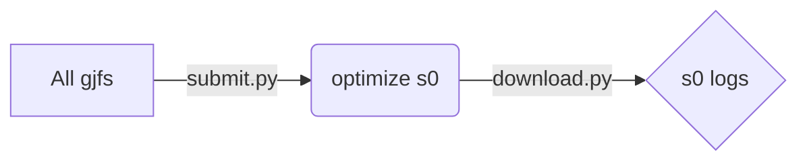
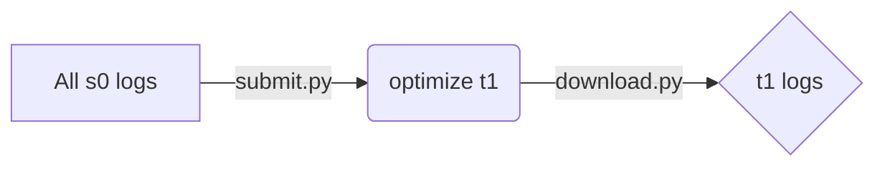
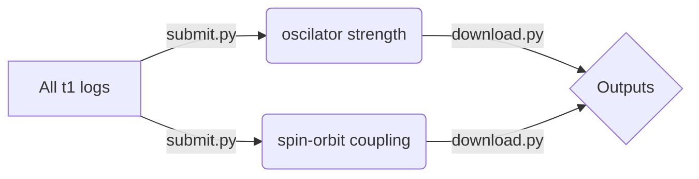

# Workflow for Phorsphorescent OLED Metal Complexe Molecules

## 0. The workflow is supported by [dflow](https://github.com/deepmodeling/dflow), which a Python framework for constructing scientific computing workflows

(though, some useful scripts for generating inputs can be used even not using dflow, see [below](#jump))

- Use dflow to submit the workflow job on the platform of [Bohrium](https://bohrium.dp.tech/)

  Before using it, config the username and password in `oled_flow.py`:

  ```python
  lebesgue_context = LebesgueContext(
                username="Bohrium username",
                password="Bohrium password",
  ```

  Then carry out the workflow for a given molecular metal complexe structure:
  
  ```bash
  git clone https://github.com/jiangtong1000/PhorsOLED_workflow.git
  cd PhorsOLED_workflow
  cp your_database/mol1.gjf .
  python oled_dflow.py
  ```
  
  and it carries out the following steps automatically.

  ```mermaid
    graph
  E[mol1.gjf] -->|Gaussian|F(optimize s0)
  F -->|Gaussian|A{optimize t1}
  A -->|Dalton|B(oscilator strength)
  A -->|ORCA|C(spin-orbit coupling)
  B -->D{Outputs}
  C --> D
  A --> D
  F --> D{All Parameters}
  D -->|MOMAP| G{decay rate, PLQY}
  ```


## 1. <span id="jump">Basis scripts for input generation</span>

- Generate s0-opt.com, **Gaussian**

  Convert a *Gaussian* default gjf/com, or xyz files into the *Gaussian* input file for gound singlet **S0** optimization and frequency analysis (which is used for following rate calculation based on Fermi's golden rule),

  ```python
  import input_gen
  element_xyz = read_init_xyz("complexe1.gjf")
  multiplicity = 1
  make_opt_input(element_xyz, multiplicity) # generate ./s0-opt/s0-opt.com
  ```

- Generate t1-opt.com, **Gaussian**

  Extract the optimized geometry from the log files of **S0** optimization, which is used as initial guess, and generate input file for optimizing (+frequency calculation) triplet **T1**,

  ```python
  multiplicity = 3
  element_xyz = read_init_xyz("s0-opt/s0-opt.log") # output of S0 optimization. 
  make_opt_input(element_xyz, multiplicity) # generate ./t1-opt/t1-opt.com
  ```

- Generate input for triplet oscillator strength, **Dalton**

  ```python
  make_edme_input("t1-opt/t1-opt.log") # generate input file ./edme/t1-opt.mol for Dalton
  ```

- Generate input for T1->S0 spin-orbit coupling, **ORCA**

  ```python
  make_soc_input("t1-opt/t1-opt.log") # generate input file ./soc/soc.inp for ORCA
  ```

## 2. Batch tasks management on [Bohrium](https://bohrium.dp.tech/)

You can also directly submit batch tasks on Bohrium, without using dflow, which is only semi-automatic.

After integrating the functions stated above, the workflow in the platform of [Bohrium](https://bohrium.dp.tech/) is totally handled by two script files: `submit.py` and `download.py` that submit calculations / download results for a batch of molcules at the same time, both of which run with an argument for job type including `"s0-opt", "t1-opt", "soc", "edme"`.

All gjf files generated by Gaussview (no need for defining functional, basis, pseudo potential, etc.) are stored in the current foler, **and all commands are excecuted in this foler**. The **S0** opt batch tasks can be permormed by

```bash
# the database contains mol1.gjf, mol2.gjf, ...
python submit.py "s0-opt"
# After the tasks finished in Bohrium,
python download.py "s0-opt" 
```

Now we have the output files automatically stored in  `mol1/s0-opt`, `mol2/s0-opt`, ...



**T1** opt batch tasks

```bash
python submit.py "t1-opt"
# After the tasks finished,
python download.py "t1-opt"
```

Now we have the output files automatically stored in  `mol1/t1-opt`, `mol2/t1-opt`, ...



The next step is calculating the transition dipole moment of **T1**，and spin-orbit coupling (SOC) for **T1** and **S0**, which can be performed simultaneously. Before running the following code, please make sure the `gjf2mol.py` and `edme.dal` are contained in the current folder.

```bash
python submit.py "soc"
# After the tasks finished,
python download.py "soc"

python submit.py "edme"
# After the tasks finished,
python download.py "edme"
```

Now we have the output files automatically stored in  `mol1/soc`, `mol2/soc`, ...  `mol1/edme`, `mol2/edme`, ...


