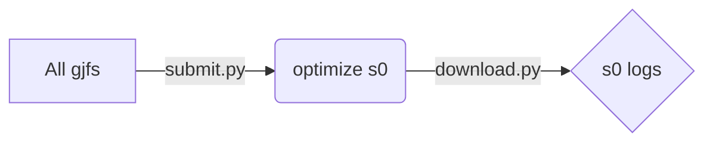
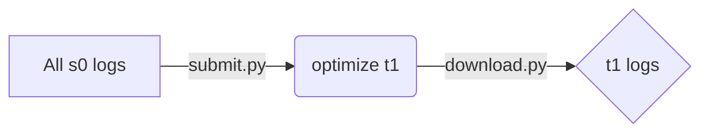
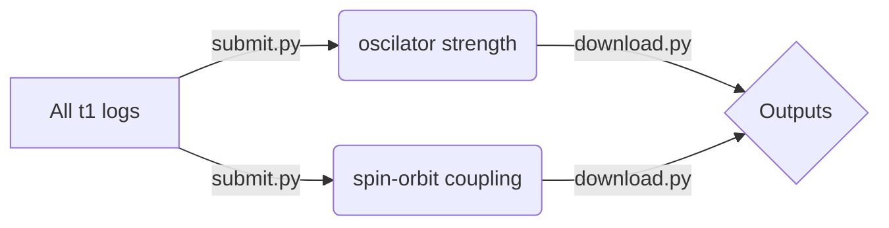

# QM Workflow for Phorsphorescent OLED Molecules

## 1. Example for one molecule:

- Generate s0_opt.com, **Gaussian**

  Convert a *Gaussian* default gjf/com, or xyz files into the *Gaussian* input file for gound singlet **S0** optimization and frequency analysis (which is used for following rate calculation based on Fermi's golden rule),

  ```python
  import input_gen
  element_xyz = read_init_xyz("complexe1.gjf")
  multiplicity = 1
  make_opt_input(element_xyz, multiplicity) # generate ./s0_opt/s0_opt.com
  ```

- Generate t1_opt.com, **Gaussian**

  Extract the optimized geometry from the log files of **S0** optimization, which is used as initial guess, and generate input file for optimizing (+frequency calculation) triplet **T1**,

  ```python
  multiplicity = 3
  element_xyz = read_init_xyz("s0_opt/s0_opt.log") # output of S0 optimization. 
  make_opt_input(element_xyz, multiplicity) # generate ./t1_opt/t1_opt.com
  ```

- Generate input for triplet oscillator strength, **Dalton**

  ```python
  make_edme_input("t1_opt/t1_opt.log") # generate input file ./edme/t1_opt.mol for Dalton
  ```

- Generate input for T1->S0 spin-orbit coupling, **ORCA**

  ```python
  make_soc_input("t1_opt/t1_opt.log") # generate input file ./soc/soc.inp for ORCA
  ```

 ## 2. Batch tasks management in [Bohrium](https://bohrium.dp.tech/)

After integrating the functions stated above, the workflow in the platform of [Bohrium](https://bohrium.dp.tech/) is totally handled by two script files: `submit.py` and `download.py` that submit calculations / download results for a batch of molcules at the same time, both of which run with an argument for job type including `"s0", "t1", "soc", "edme"`.







All gjf files generated by Gaussview (no need for defining functional, basis, pseudo potential, etc.) are stored in `gjf_database`.

The **S0** opt batch tasks can be permormed by

```bash
cd gjf_database 
# the database contains mol1.gjf, mol2.gjf, ...
python submit.py "s0"
# After the tasks finished in Bohrium,
python download.py "s0" 
```

Now we have the output files stored in  `gjf_database/mol1/s0_opt`, `gjf_database/mol2/s0_opt`, ...

**T1** opt batch tasks

```bash
python submit.py "t1"
# After the tasks finished,
python download.py "t1"
```

Now we have the output files stored in  `gjf_database/mol1/t1_opt`, `gjf_database/mol2/t1_opt`, ...

The next step is calculating the transition dipole moment of **T1**，and spin-orbit coupling (SOC) for **T1** and **S0**, which can be performed simultaneously. Before running the following code, please make sure the `gjf2mol.py` and `edme.dal` are contained in `gjf_database`.

```bash
python submit.py "soc"
# After the tasks finished,
python download.py "soc"

python submit.py "edme"
# After the tasks finished,
python download.py "edme"
```

Now we have the output files stored in  `gjf_database/mol1/soc`, `gjf_database/mol2/soc`, ...  `gjf_database/mol1/edme`, `gjf_database/mol2/edme`, ...

